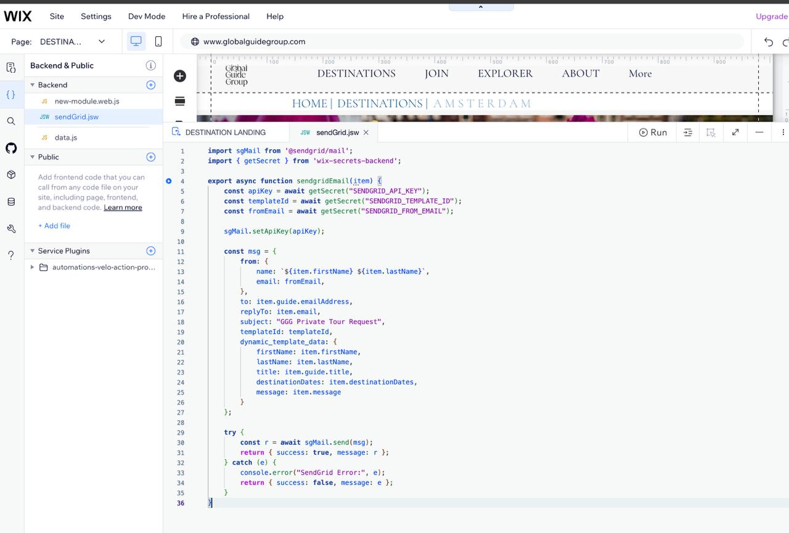
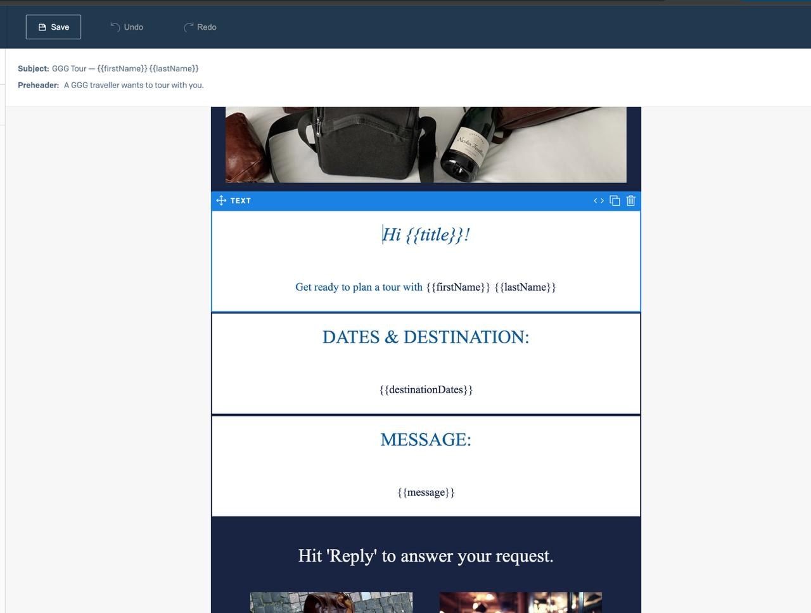

# SendGrid Email Demo for Wix (Global Guide Group)

This repository demonstrates **how to send secure, dynamic emails** from a **Wix website backend** using [SendGrid](https://sendgrid.com/) and **Wix Secrets Manager**.  

⭐ It also doubles as a **beginner‑friendly guide**

We use this approach at **Global Guide Group (GGG)** to:  
- Relay **private tour requests to our guides**  
- Keep **guide emails and API keys safe**  
- Personalize each email using **SendGrid dynamic templates**  

This setup ensures that **no keys or email addresses** are ever exposed to the public.

---

### Why No Live Demo?

- Sending emails requires a **real API key and domain sender**  
- If we exposed this as a live demo, anyone could:
  - Abuse the key to send spam
  - Get our domain **blacklisted**
  - Damage our SendGrid sender reputation

Instead, this repo is a **safe reference implementation**:  
- Clone it, add your own keys, and test privately  
- Use it as a template to build secure contact forms for team members on your own site

---

## Quick Start for Wix Beginners

1. **Enable Dev Mode**  
   - In your Wix Editor, turn on **Dev Mode** from the top menu.

2. **Add a Backend File**  
   - Click the **Backend folder icon** (two curly braces `{}`) in the left-hand panel  
   - Click **+ Add File → New Web Module (.jsw)**  
   - Name it something like `sendGrid.jsw`  

3. **Copy the Secure Script**  
   - Paste the contents of `sendGrid.jsw` from this repo into your new file  
   - This script uses:  
     - `SENDGRID_API_KEY`  
     - `SENDGRID_FROM_EMAIL`  
     - `SENDGRID_TEMPLATE_ID`  



*Above: Backend file in Wix with Secrets Manager configured for secure API key storage.*

4. **Use Wix Secrets Manager**  
   - Open **Dev Mode → Secrets Manager**  
   - Add three secrets with these exact names:  

     ```
     SENDGRID_API_KEY
     SENDGRID_FROM_EMAIL
     SENDGRID_TEMPLATE_ID
     ```

   - Example values:  
     - **API Key:** From your SendGrid dashboard  
     - **From Email:** hello@yourdomain.com (must be a verified sender)  
     - **Template ID:** From your dynamic email template in SendGrid

5. **Connect to Your Form**  
   - On your Wix site, call the `sendgridEmail(item)` function when a form is submitted  
   - `item` should contain:  
     - Visitor’s name, email, and message  
     - Guide email and title (if sending to a specific guide)  

     ---

## Dynamic Template Variables in SendGrid

This project uses **SendGrid Dynamic Templates** to personalize the emails sent to your guides.  
When you submit a form, data from your site is injected into the template using variables.

In your SendGrid dynamic email template, you can use matching Handlebars variables like:

Hello {{title}},

You have a new private tour request from {{firstName}} {{lastName}}!

Travel Dates: {{destinationDates}}
Message:
{{message}}

Just to use our example from our Tour Guide Website, and of course your application will
likely be different. 

## How It Works 
	    
1.	**Submit Form on Wix Site**

	- User fills in first name, last name, dates, and a message

2.	**Backend Function Runs**

	- sendgridEmail(item) sends the email through SendGrid    

3.	**SendGrid Replaces Variables**

	- All {{variableName}} placeholders are replaced with real user data
	- The guide receives a personalized email without exposing any emails or keys


## Quick Tips

- Variable names in dynamic_template_data must match your SendGrid template variables exactly

- Use {{variableName}} in your SendGrid template for text replacements

- Test your template with SendGrid’s Preview to verify variables are rendering correctly



*Above: Example of a SendGrid dynamic email template using {{variables}} to personalize the message.*

### Example

In the `sendgridEmail(item)` function, we send this data:

```js

dynamic_template_data: {
    firstName: item.firstName,
    lastName: item.lastName,
    title: item.guide.title,
    destinationDates: item.destinationDates,
    message: item.message
}

```

6. **Test It**

- Preview the site and submit a form  
- You should receive a personalized email from your template!

---

## Project Structure

```
├── index.js           # Simple Node.js demo for local testing
├── sendGrid.jsw       # Secure Wix backend function using SendGrid + Secrets Manager
├── .env.example       # Example of local environment variable setup
├── README.md          # Documentation (this file)
└── .gitignore         # Ignores node_modules and sensitive files
```
---

## Security Notes

- **Never** commit your real API key or emails to GitHub  
- Use **Wix Secrets Manager** to store all sensitive values
- Backend `.jsw` files ensure keys are **not exposed to the browser**  
- If your key is ever exposed, **rotate it immediately in SendGrid**

Why? Well, someone could take your key, send emails on your behalf
to spam people, get your domain blacklisted and ruin your campaigns 
indefinitely, to name a few examples...
There are lots of great reasons to follow best practice from a OPSEC 
perspective. 

---

## Community & Educational Value

This repository is designed to be **approachable for small business owners and beginner developers** who:  
- Want to send **secure, personalized emails** from Wix  
- Don’t want to **expose their email address or API key**  
- Prefer a **step‑by‑step, working example** over abstract docs  

Try not to be intimidated; it's not as hard as it looks superficially, and if you like, most LLMs 
can help walk you through the process! 

If this project helps you get started, consider **sharing your experience** to help the next beginner!  
